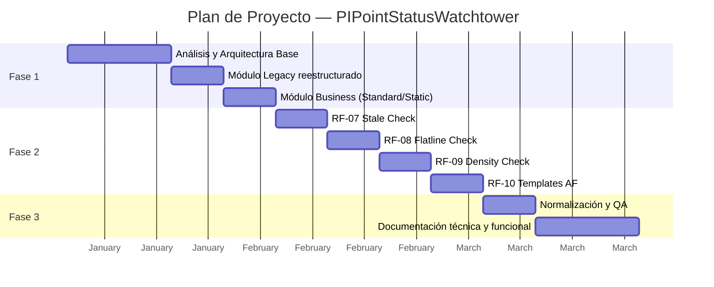
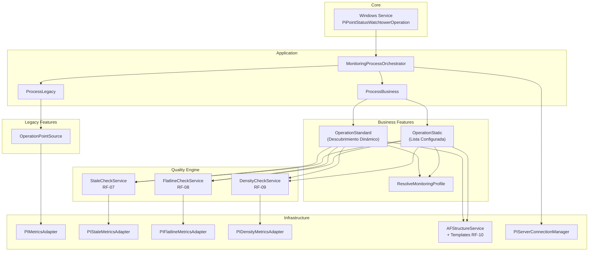

# PIPointStatusWatchtower — Evolución del Sistema
## Plan de Proyecto · 3 Fases

---

**Proyecto**: PIPointStatusWatchtower — Evolución y Reestructuración  
**Cliente**: CONTAC  
**Duración total**: 3 meses (12 semanas)  
**Plataforma**: .NET Framework 4.7.2 · OSIsoft AF SDK · Windows Service  

---

## Resumen Ejecutivo

El proyecto consiste en la evolución del servicio **PIPointStatusWatchtower**, originalmente diseñado para monitoreo técnico de infraestructura PI (Point Sources), hacia una plataforma dual que incorpora un nuevo motor de monitoreo de calidad de datos orientado al negocio.

La evolución se estructura en **3 fases** que cubren desde la rearquitectura base hasta la documentación formal del sistema.

---

# Fase 1 — Rearquitectura y Definición de la Base del Sistema

**Duración**: 4 semanas (Mes 1)  
**Objetivo**: Analizar el sistema existente, definir la nueva arquitectura de capas, e implementar la estructura dual Legacy/Business que soportará todos los módulos de calidad.

## Entregables

| # | Entregable |
|---|-----------|
| E1.1 | Análisis técnico del sistema existente y viabilidad de evolución |
| E1.2 | Definición de arquitectura de capas (Core, Application, Infrastructure, Services) |
| E1.3 | Módulo Legacy reestructurado (PointSource, InterfaceID) |
| E1.4 | Módulo Business con modos Standard (descubrimiento dinámico) y Static (lista configurada) |
| E1.5 | Orquestador de procesos (MonitoringProcessOrchestrator) |
| E1.6 | Gestor centralizado de conexiones PI (`PIServerConnectionManager`) |
| E1.7 | Sistema de configuración basado en perfiles YAML |
| E1.8 | Motor de Feature Flags por perfil de monitoreo |

## Detalle de actividades

### 1.1 — Análisis y Diseño Arquitectónico
- Análisis del código fuente existente y sus limitaciones
- Evaluación de viabilidad técnica sobre .NET Framework 4.7.2 + AF SDK
- Diseño de arquitectura de capas con separación de responsabilidades
- Definición del modelo de configuración YAML con soporte multi-perfil

### 1.2 — Implementación de Arquitectura Base
- Reestructuración de carpetas y namespaces del proyecto
- Implementación del patrón Orquestador para coordinación de procesos
- Centralización de conexiones PI Server (lectura/escritura)
- Motor de resolución de perfiles de monitoreo por grupo

### 1.3 — Módulo Legacy (Monitoreo Técnico)
- Reestructuración del flujo de monitoreo por PointSource
- Adaptación del agrupamiento técnico con soporte configurable
- Escritura de métricas mediante adapter dedicado (PIMetricsAdapter)

### 1.4 — Módulo Business (Monitoreo de Calidad de Negocio)
- Implementación del modo **Standard**: descubrimiento dinámico de grupos via atributo ExDesc con prefijo configurable
- Implementación del modo **Static**: iteración sobre lista de contextos de negocio configurados
- Parser de ExDesc para extracción de grupo de negocio
- Jerarquía dinámica en Asset Framework (creación automática de elementos AF)
- Asignación de perfiles de monitoreo por grupo con Feature Flags

## Requerimientos cubiertos

| Req | Descripción |
|-----|-------------|
| R-01 | Monitoreo técnico Legacy (PointSource) |
| R-02 | Agrupamiento por contexto de negocio via ExDesc |
| R-03 | Modos de descubrimiento Standard y Static |
| R-04 | Jerarquía dinámica en Asset Framework |
| R-05 | Feature Flags y perfiles de monitoreo |
| R-06 | Configuración multi-perfil via YAML |

---

# Fase 2 — Implementación de Módulos de Calidad de Datos

**Duración**: 4 semanas (Mes 2)  
**Objetivo**: Desarrollar e integrar los módulos de análisis de calidad de datos (Stale, Flatline, Density) y la estandarización de templates en Asset Framework.

## Entregables

| # | Entregable |
|---|-----------|
| E2.1 | Servicio de Stale Check (frescura de datos) con buckets de latencia |
| E2.2 | Servicio de Flatline Check (detección de valores congelados) |
| E2.3 | Servicio de Density Check (densidad de eventos por hora) |
| E2.4 | Templates AF estandarizados (Core + QualityExtension) |
| E2.5 | Adapters de escritura dedicados por módulo |
| E2.6 | Configuración appsettings.yml completa con perfiles y umbrales |

## Detalle de actividades

### 2.1 — RF-07: Stale Check (Frescura de Datos)
- Cálculo de latencia por tag (diferencia entre último valor y tiempo actual)
- Clasificación por buckets configurables (ej. Level1 >15min, Level2 >60min, Level3 >240min)
- Cálculo de `MaxGroupLatency` por grupo de negocio
- Exclusión automática de tags con valor Bad del análisis
- Adapter de escritura PIStaleMetricsAdapter

### 2.2 — RF-08: Flatline Check (Detección de Valores Congelados)
- Análisis de varianza cero en últimos N eventos (configurable via `FlatlineSampleCount`)
- Exclusión inteligente de tags digitales, Step, y tags marcados con `;IGNORE_FLATLINE;`
- Conteo de tags con desviación estándar = 0 (frozen)
- Adapter de escritura `PIFlatlineMetricsAdapter`

### 2.3 — RF-09: Density Check (Densidad de Eventos)
- Conteo de eventos registrados en la última hora via `RecordedValues`
- Evaluación contra umbrales `MinEventsPerHour` y `MaxEventsPerHour`
- Detección de baja densidad (falta de datos) y alta densidad (ruido)
- Desactivación granular: `MinEventsPerHour=0` desactiva baja densidad; `;IGNORE_DENSITY;` excluye tags individuales
- Adapter de escritura PIDensityMetricsAdapter

### 2.4 — RF-10: Estandarización de Templates en Asset Framework
- Creación de template base `TPL_PPSW_Core` (TotalTags, BadValCount, DuplicateCount)
- Creación de template `TPL_PPSW_QualityExtension` con herencia de Core
- Asignación dinámica de template según flags activos del perfil
- Configuración automática de Data References (PI Point DR) por atributo

## Requerimientos cubiertos

| Req | Descripción |
|-----|-------------|
| RF-07 | Stale Check — Análisis de frescura y latencia |
| RF-08 | Flatline Check — Detección de valores congelados |
| RF-09 | Density Check — Análisis de densidad de eventos |
| RF-10 | Templates AF — Estandarización y asignación dinámica |

---

# Fase 3 — Normalización, Pruebas y Documentación del Proyecto

**Duración**: 4 semanas (Mes 3)  
**Objetivo**: Consolidar el código, normalizar convenciones, ejecutar pruebas de integración, y producir la documentación técnica y funcional completa del sistema.

## Entregables

| # | Entregable |
|---|-----------|
| E3.1 | Código normalizado (namespaces, convenciones, eliminación de dead code) |
| E3.2 | Validación del sistema compilado y pruebas en entorno de integración |
| E3.3 | Documento de Arquitectura del Sistema (SAD) |
| E3.4 | Diagramas técnicos (componentes, flujos, despliegue, templates AF) |
| E3.5 | Especificación funcional de cada módulo (RF-07 a RF-10) |
| E3.6 | Diccionario de configuración (appsettings.yml) |
| E3.7 | Catálogo de PI Tags y Atributos AF generados |
| E3.8 | Guías operacionales (instalación, mantenimiento, troubleshooting) |

## Detalle de actividades

### 3.1 — Normalización y QA
- Auditoría y normalización de namespaces del proyecto
- Eliminación de código muerto y bloques comentados
- Consolidación de referencias de build (AFSDK, NuGet)
- Resolución de warnings de compilación
- Matriz de trazabilidad requerimiento → componente → test

### 3.2 — Documentación de Arquitectura
- Documento de Arquitectura del Sistema (visión, decisiones, capas, restricciones)
- Diagrama de Componentes (C4 Level 2)
- Diagramas de flujo de ejecución por modo (Legacy, Business Standard, Business Static)
- Diagrama físico de despliegue
- Diagrama de herencia de templates AF

### 3.3 — Documentación Funcional
- Especificación detallada de cada RF con reglas de negocio, parámetros y exclusiones
- Diccionario de configuración completo (cada propiedad YAML documentada)
- Catálogo de PI Tags generados y convenciones de naming
- Catálogo de atributos AF por template

### 3.4 — Guías Operacionales
- Guía de instalación y despliegue del servicio Windows
- Guía de mantenimiento y evolución (cómo agregar nuevos módulos)
- Guía de troubleshooting (problemas comunes, interpretación de logs)
- Checklist de release para futuras versiones

---

## Resumen de Inversión

| Fase | Duración | Entregables clave |
|------|----------|-------------------|
| **Fase 1** — Rearquitectura y Base | 4 semanas | Arquitectura dual Legacy/Business, orquestador, perfiles, Feature Flags |
| **Fase 2** — Módulos de Calidad | 4 semanas | Stale, Flatline, Density, Templates AF |
| **Fase 3** — Documentación | 4 semanas | SAD, diagramas, especificaciones funcionales, guías operacionales |
| **Total** | **12 semanas (3 meses)** | **10 requerimientos + documentación completa** |

---

## Arquitectura Final del Sistema

